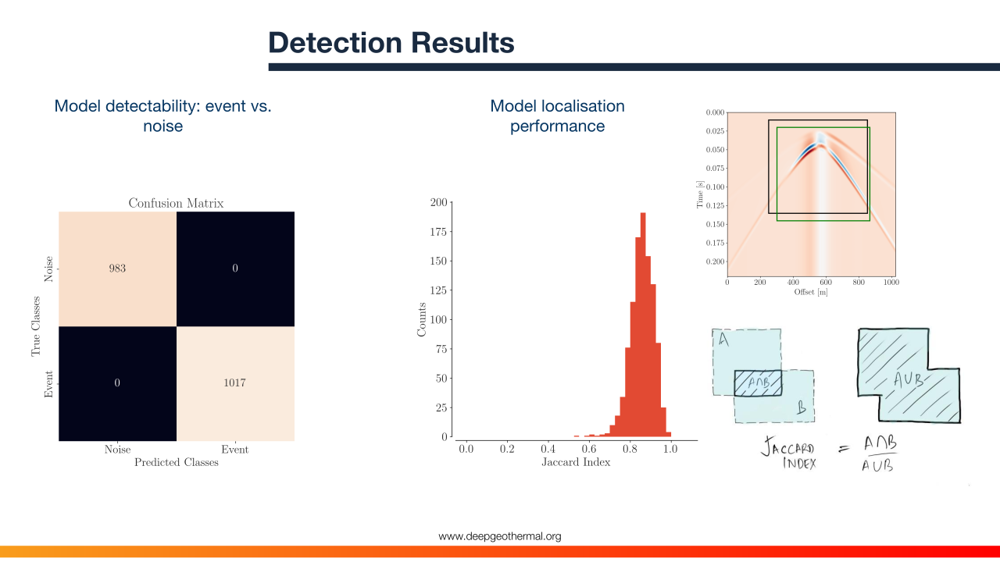

# EADET - earthquake detection in DAS fibre-optic data using object-detection deep learning

This project presents the first demonstration of the transferability
of a convolutional neural network (ConvNet) trained to detect micro-seismic
earthquakes in one distributed acoustic sensing (DAS) fiber-optic data.

    

## Dependencies

- Python (>= 3.6, with development headers)
- NumPy (>= 1.21.2)
- [PyTorch](https://pytorch.org/) (>= 1.9.1)
- xarray (>= 0.19.0)
- [Pyrocko](https://pyrocko.org/) (>= 2021.09.14)

    

## Contact Information
This repository is still a work in progress. Any feedback/suggestions
are welcome.

- Nima Nooshiri - nima.nooshiri@gmail.com
